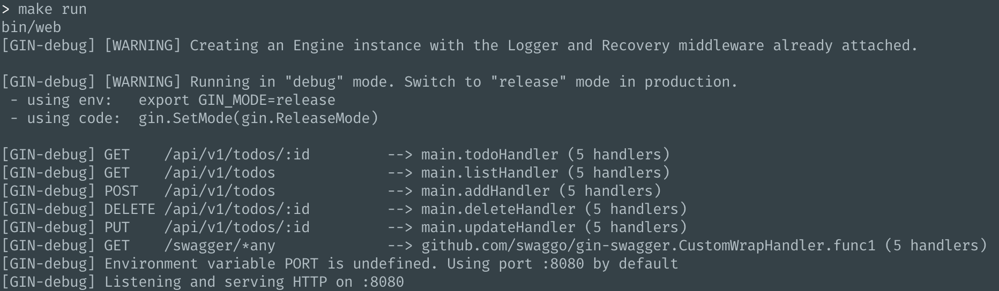
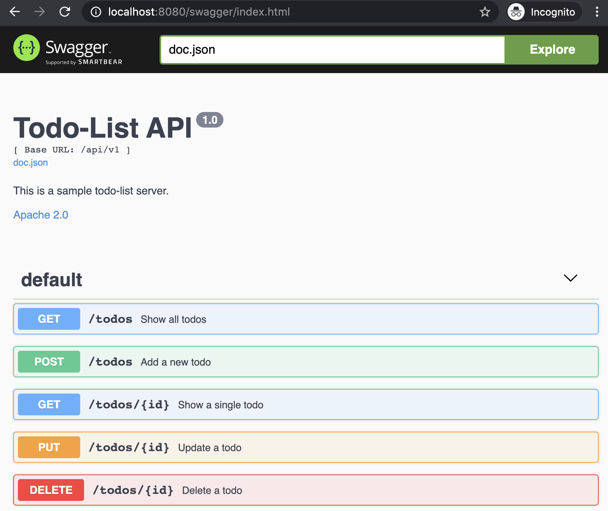
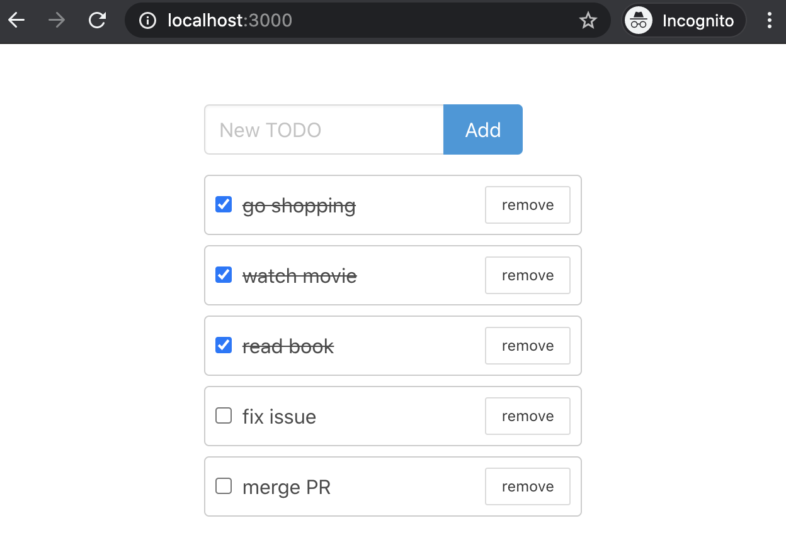

# 使用 Swagger 为后端 REST API 自动生成前端代码

前后端分离时，一般情况下，后端每增加一个 API，前端都需要同步地手动新增一个访问此 API 的方法，后端修改它的实现时，前端也要同步修改，如果使用 TypeScript，还要在前端同时声明相应的 model 类型。

而使用 swagger 及相应的工具，可以为后端的 REST API 自动生成前端的 API 访问代码，省去了手动维护的麻烦。

本文通过实现一个简单的 Todo APP 的前后端来展示整个流程，包括以下步骤：

1. 使用 golang 和 gin web 框架实现 Todo APP 的后端 API
1. 使用 swaggo/swag，将后端 API 导出成 json/yaml 描述文件
1. 使用 swaggo/swag，生成后端 API 的 swagger ui，作为 API 的 docs 及 playground
1. 使用 openapi-generator，从 API 的 json/yaml 描述文件生成前端 TypeScript 代码
1. 使用生成的前端代码访问 API，并加上 UI，实现完整的前端，对 Todo 进行添加、查看、修改及删除操作

最终效果：

后端：



swagger ui:



前端：



## 1. 使用 gin web 框架实现 Todo APP 后端 API

_注意：本文示例的代码只是完整代码的片断，完整代码请访问 [GitHub](https://github.com/baurine/swag-example)_

首先我们创建一个 go modules 项目，moduel 名设置为 `swag-example`。

```shell
$ mkdir swag-example
$ cd swag-example
$ go mod init swag-example
```

在项目根目录下创建 main.go。

首先定义 Todo 的结构体：

```go
type Todo struct {
	ID        string `json:"id"`
	Content   string `json:"content"`
	Done      bool   `json:"done"`
	CreatedAt int64  `json:"created_at"`
}
```

并使用一个 slice 在内存中存储所有的 Todo：

```go
var todos = make([]Todo, 0)
```

对 Todo 进行增删改查，再加上获取列表的 API，一共需要 5 个 API，所以我们定义 5 个路由：

```go
package main

import (
	"net/http"

	"github.com/gin-gonic/gin"
	cors "github.com/rs/cors/wrapper/gin"
)

func main() {
	r := gin.Default()
	r.Use(cors.AllowAll())  // 允许客户端跨域访问
	r.Use(MWHandleErrors()) // 处理错误的中间件
	v1 := r.Group("/api/v1")
	{
		todos := v1.Group("/todos")
		{
			todos.GET(":id", todoHandler)
			todos.GET("", listHandler)
			todos.POST("", addHandler)
			todos.DELETE(":id", deleteHandler)
			todos.PUT(":id", updateHandler)
		}
	}

	r.Run()
}
```

然后分别实现这五个 API，以 addHandler 的实现为例：

```go
type AddTodoReq struct {
	Content string `json:"content"`
}

func addHandler(c *gin.Context) {
	var req AddTodoReq
	if err := c.ShouldBindJSON(&req); err != nil {
		_ = c.Error(err)
		return
	}

	todo := Todo{
		ID:        uuid.New().String(),
		Content:   req.Content,
		Done:      false,
		CreatedAt: time.Now().Unix(),
	}
	todos = append(todos, todo)
	c.JSON(http.StatusOK, todo)
}
```

然后编写一个简单的 Makefile 来简化项目的编译和运行：

```makefile
.PHONY: server

default: server

server:
	go build -o bin/web main.go

run:
	bin/web
```

然后执行 `make && make run`，项目就愉快地跑起来了：

```
[GIN-debug] GET    /api/v1/todos/:id         --> main.todoHandler (5 handlers)
[GIN-debug] GET    /api/v1/todos             --> main.listHandler (5 handlers)
[GIN-debug] POST   /api/v1/todos             --> main.addHandler (5 handlers)
[GIN-debug] DELETE /api/v1/todos/:id         --> main.deleteHandler (5 handlers)
[GIN-debug] PUT    /api/v1/todos/:id         --> main.updateHandler (5 handlers)
```

目前，我们可以使用 curl 或 postman 来测试这些 API，第三步集成 swagger ui 后就可以用 swagger ui 来测试这些 API 了。

## 2. 使用 swaggo/swag，将后端 API 导出成 json/yaml 描述文件

实现了 API 后，我们就可以使用 [swaggo/swag](https://github.com/swaggo/swag) 来生成 API 的 json/yaml 描述文件，及 swagger ui 作为 docs 和 playground。我们先实现前者。

根据 [swaggo/swag](https://github.com/swaggo/swag) 的文档，大致需要下面几步：

1. 下载 swag

   ```shell
   $ go get -u github.com/swaggo/swag/cmd/swag
   ```

1. 在项目入口，即 main.go 开头，用注释声明 General API Info，包括 title，version 等信息。比如此项目这部分信息是这样声明的：

   ```go
   // @title Todo-List API
   // @version 1.0
   // @description This is a sample todo-list server.
   // @license.name Apache 2.0
   // @license.url http://www.apache.org/licenses/LICENSE-2.0.html
   // @BasePath /api/v1
   ```

1. 在各个 API 之前用注释声明此 API 的相关信息，比如输入，输出等。以 updateHandler 为例：

   ```go
   type UpdateTodoReq struct {
     Content string `json:"content"`
     Done    bool   `json:"done"`
   }

   // @Summary Update a todo
   // @Description update a single todo by ID
   // @Param id path string true "Todo ID"
   // @Param request body UpdateTodoReq true "Todo Body"
   // @Success 204 "no content"
   // @Failure 404 "no content"
   // @Router /todos/{id} [put]
   func updateHandler(c *gin.Context) {
     // ...
   }
   ```

   > 注意：如果你的输出只有 status code，没有 body，比如 204，那么，你不能只写成 `@Success 204` 或者 `@Success 204 ""`，可以随便填充点字符串，比如 `"no content"`

1. 执行 `swag init`。

   会看到在项目根目录新生成了一个 docs 目录，里面有 docs.go, swagger.json, swagger.yaml 三个文件，内容都是相似的，只不过是不一样的格式。里面的内容就是由刚才添加的注释生成的。比如：

   ```json
    {
        "swagger": "2.0",
        "info": {
            "description": "This is a sample todo-list server.",
            "title": "Todo-List API",
            "contact": {},
            "license": {
                "name": "Apache 2.0",
                "url": "http://www.apache.org/licenses/LICENSE-2.0.html"
            },
            "version": "1.0"
        },
        "basePath": "/api/v1",
        "paths": {
            "/todos": {
                "get": {
                    "description": "get the list of todos",
                    "produces": [
                        "application/json"
                    ],
                    "summary": "Show all todos",
                    "responses": {
                        "200": {
                            "description": "OK",
                            "schema": {
                                "type": "array",
                                "items": {
                                    "$ref": "#/definitions/main.Todo"
                                }
                            }
                        }
                    }
                },
        ...
    }
   ```

   执行 `swag init` 时，如果入口文件不是 main.go，比如是 cmd/main.go，则可以用 `--generalInfo cmd/main.go` 参数指定入口，默认生成的结果是放在 docs 目录，如果想用其它的目录名，可以用 `--output` 指定输出目录名，比如 `--output spec`。完整示例：`swag init --generalInfo cmd/main.go --output spec`。

## 3. 使用 swaggo/swag，生成后端 API 的 swagger ui，作为 API 的 docs 及 playgroud

> 注意：这一步是可选的。如果你不需一个带 ui 页面的 API docs，或者更偏好用 postman 测试 API，那么这一步可以跳过。

接下来我们可以为此项目集成 swagger ui，方便调试 API 接口并作为 API 的文档页面。

注意到上一步生成的 docs/docs.go 文件了吗？它包括了 API 的所有信息，它有一个 init() 函数，在 init() 里进行 swagger 的注册。所以我们要在 main.go 中 import 这个 package。

另外，swagger ui 页面所使用 assets (html/js/css 等) 在 `github.com/swaggo/files` 中，我们需要把这些静态资源绑定到 `/swagger/*` 路由下。

最终实现代码如下所示：

```go
import (
  // ...
	// for generate swagger ui
	_ "swag-example/docs"

	swaggerFiles "github.com/swaggo/files"     // swagger embed files
	ginSwagger "github.com/swaggo/gin-swagger" // gin-swagger middleware
)

func main() {
  // ...
	// must access /swagger/index.html
	// access /swagger will get 404
	r.GET("/swagger/*any", ginSwagger.WrapHandler(swaggerFiles.Handler))

	_ = r.Run()
}
```

重启程序，然后在浏览访问 http://127.0.0.1:8080/swagger/index.html 就可以看到 swagger ui 的页面了，在此页面可以方便地测试接口。(访问 http://127.0.0.1:8080/swagger 会得到 404，必须带上后面的 /index.html，后面可以考虑优化)


## 4. 使用 openapi-generator，从 API 的 json/yaml 描述文件生成前端 TypeScript 代码

到此，后端部分已实现完毕，我们来看前端部分的实现。

在第二步中，我们使用 `swag init` 命令生成了后端 API 的 json/yaml 描述文件。通过 [OpenAPI Generator](https://github.com/OpenAPITools/openapi-generator) 这个工具，可以通过描述文件生成各种客户端代码，以及服务端的 stubs (我理解是只生成接口的声明代码，具体实现还得自己写)。[这个列表](https://openapi-generator.tech/docs/generators) 显示所有支持的生成的代码类型。鉴于我们使用 TypeScript，并使用 axios API 请求库，所以我们选择列表中的 typescript-axios。

不过在此之前，我们先用 create-react-app 先创建一个前端项目。在项目根目录执行以下操作：

```shell
$ npx create-react-app swag-example-ui --template typescript
$ mv swag-example-ui ui
```

接下来我们安装 openapi-generator，这个工具是用 Java 开发的，所以本地机器上至少要安装 Java JRE 才能跑起来。它封装成了相应的 npm 包，所以我们可以用 npm/yarn 来安装它。

```shell
$ cd ui
$ yarn add @openapitools/openapi-generator-cli
```

接下来就可以用 openapi-generator-cli 命令来自动生成前端代码了，我们把这个命令加到 ui/package.json 的 `scripts` 中：

```json
  "scripts": {
    // ...
    "gen:api": "openapi-generator-cli generate -i ../docs/swagger.yaml -g typescript-axios -c .openapi_config.yaml -o src/apiClient/api"
  }
```

解释一下这条命令，`-i ../docs/swagger.yaml` 用来指定 API 描述文件路径；`-g typescript-axios`，用来指定目标 generator，即生成的代码类型；`-c .openapi_config.yaml`，用来指定 generator 的配置，比如生成的代码中变量的 naming style 是用 snake_case 呀，还是 camelCase，亦或是 PascalCase，这里可以查看 [typescript-axios 所支持的所有配置选项](https://openapi-generator.tech/docs/generators/typescript-axios/)；`-o src/apiClient/api` 用来指定代码输出目录。

本项目中 .openapi_config.yaml 的内容：

```yaml
enumPropertyNaming: original # original 表示保持和 go 代码中一样的名字
modelPropertyNaming: original
supportsES6: true
```

接着，执行 `yarn gen:api`，就可以发现，增加了 src/apiClient/api 目录，里面放置了自动生成的代码。

```
src
├── App.test.tsx
├── App.tsx
├── apiClient
│   ├── api
│   │   ├── api.ts
│   │   ├── base.ts
│   │   ├── configuration.ts
│   │   ├── git_push.sh
│   │   └── index.ts
```

主要代码都在 api.ts 中，可以稍微瞄一眼它的内容：

```ts
export interface MainTodo {
    /**
     *
     * @type {string}
     * @memberof MainTodo
     */
    content?: string;
    /**
     *
     * @type {number}
     * @memberof MainTodo
     */
    created_at?: number;
    /**
     *
     * @type {boolean}
     * @memberof MainTodo
     */
    done?: boolean;
    /**
     *
     * @type {string}
     * @memberof MainTodo
     */
    id?: string;
}

//...

    /**
     * get the single todo by ID
     * @summary Show a single todo
     * @param {string} id TODO ID
     * @param {*} [options] Override http request option.
     * @throws {RequiredError}
     * @memberof DefaultApi
     */
    public todosIdGet(id: string, options?: any) {
        return DefaultApiFp(this.configuration).todosIdGet(id, options).then((request) => request(this.axios, this.basePath));
    }
```

可见它为后端的 model 及 API 自动生成了相应的类型声明及访问 API 的方法。

接下来我们就可以使用它了，如何使用呢。

PS: 在编译前端项目时，遇到了一个错误：

```
Failed to compile.

TypeScript error in .../swag-example/ui/src/apiClient/api.ts(113,20):
The operand of a 'delete' operator must be optional.  TS2790

    111 |             localVarUrlObj.query = {...localVarUrlObj.query, ...localVarQueryParameter, ...options.query};
    112 |             // fix override query string Detail: https://stackoverflow.com/a/7517673/1077943
  > 113 |             delete localVarUrlObj.search;
        |                    ^
    114 |             let headersFromBaseOptions = baseOptions && baseOptions.headers ? baseOptions.headers : {};
    115 |             localVarRequestOptions.headers = {...localVarHeaderParameter, ...headersFromBaseOptions, ...options.headers};
```

原因是 TypeScript 4.0 对 delete 操作新增了 check，delete 的字段必须是 optional 的才行。为了通过编译，暂时先把 TypeScript 降级到 3.9.7 了。

## 5. 使用生成的前端代码访问 API，并加上 UI，实现完整的前端，对 Todo 进行添加、查看、修改及删除操作

通过查看 api.ts 的代码发现，生成的 API 的访问方法都是 DefaultApi class 的成员方法，因此我们只要调用 DefaultApi 的构造函数，创建一个实例，然后调用实例的方法就行了，如下所示：

```ts
const apiClient = new DefaultApi()
apiClient.todosIdGet('xxxx')
```

但是，这种情况下，apiClient 的 basePath 是 `http://localhost/api/v1`，并不符合需求，而且，我们想添加对请求失败时的错误处理，所以我们需要做一些定制。此 demo 中我们在 src/apiClient 目录下创建 index.ts，用来初始化一个 DefaultApi 实例，代码如下所示：

```ts
import axios from 'axios'

import { DefaultApi } from './api'

export * from './api'

//////////////////////////////

let basePath: string
let apiClientInstance: DefaultApi

function save(instanceBasePath: string, instance: DefaultApi) {
  basePath = instanceBasePath
  apiClientInstance = instance
}

function getInstance(): DefaultApi {
  return apiClientInstance
}

function getBasePath(): string {
  return basePath
}

export default { getInstance, getBasePath }

//////////////////////////////

function initAxios() {
  const instance = axios.create()
  instance.interceptors.response.use(undefined, function (err) {
    const { response, message } = err
    const errMsg = response?.data?.message || message
    window.alert('occur error: ' + errMsg)
    return Promise.reject(err)
  })

  return instance
}

function init() {
  let apiUrl = `${
    process.env.REACT_APP_API_URL || 'http://127.0.0.1:8080'
  }/api/v1`
  const dashboardClient = new DefaultApi(undefined, apiUrl, initAxios())
  save(apiUrl, dashboardClient)
}

init()
```

之后，在任意地方就可以通过 `apiClient.getInstance().todosIdGet('xxx')` 这样来访问 API 了。

至此，一切准备就绪，接下来我们就可以加上 UI 来实现 TodoAPP 的前端页面了。

UI 实现这部分内容就跳过了，没啥可讲的，需要的话直接看源码吧，最终页面如下：


这里只展示 components/TodoItem 这个组件是如何使用 API 的：

```ts
import React from 'react'
import apiClient, { MainTodo } from '../apiClient'

interface ITodoItemProps {
  todo: MainTodo
  onUpdate: (todo: MainTodo) => void
  onDelete: (todoId: string) => void
}

export default function TodoItem({ todo, onUpdate, onDelete }: ITodoItemProps) {
  // 点击 checkbox 时修改 todo
  async function handleCheck(event: any) {
    const checked = event.target.checked
    try {
      // 访问修改 todo 的 API
      await apiClient.getInstance().todosIdPut(todo.id!, {
        content: todo.content,
        done: checked,
      })
      onUpdate({ ...todo, done: checked })
    } catch (err) {}
  }

  // 点击 remove 按钮时删除 todo
  async function handleDelete() {
    try {
      // 访问删除 todo 的 API
      await apiClient.getInstance().todosIdDelete(todo.id!)
      onDelete(todo.id!)
    } catch (err) {}
  }

  return <div>{/* ... */}</div>
}
```

最后，我们把 swag init 和 gen api 的步骤写到 Makefile 里来简化操作：

```Makefile
api:
	swag init
	cd ui && yarn gen:api
```

之后如果后端代码修改，只要执行 `make api` 就可以自动重新生成 json/yaml 描述文件及前端代码。

最后想说一下，这种方案也不是百分百完美，最大的缺点就是生成出来的前端代码体积膨胀，此例中，仅仅五个 API，api.ts 的文件行数就已经达到了将近 500 行，当然，包括很多注释，体积也达到了 19KB，而自己实现的话，怎么着 50 行也够了，体积不会超过 2~3KB。

(一个例子，tidb-dashboard 的后端 API 几十个，api.ts 的行数是 7100 行，体积 267KB。)

另外，说实话，生成的 API 的方法名字也挺丑的，不过习惯就好...

That's all.

## To Refine

- [ ] watch 后端代码文件，当文件修改时，自动执行 `make api` 重新生成前端代码
